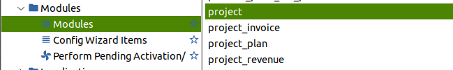

# Proyectos en Tryton

Tryton Versión 6.x  Funcionamiento del módulo de Proyecto.
[Explicación en la página oficial del modulo Proyecto](https://docs.tryton.org/projects/modules-project/en/latest/usage.html)

Primero tenemos que tener instalado el módulo.

El módulo proyecto nos permite relacionar las tareas con los partes de trabajo `timesheet module` Podemos crear partes de trabajo (Timesheet) sin usar el módulo proyecto, pero idealmente lo haremos desde la opción de proyecto. Usamos el módulo proyecto ya que de esta manera podemos controlar subtareas y controlar costes de materiales.

## Proyectos:
	Proyectos
		>Configuración
			>Arbol de proyectos y tareas # En este apartado nos da una visión general de todos los proyectos y sus caracteristicas
				>Proyectos y tareas # En este apartado nos muestra todos los proyectos y tareas
			>Estado del trabajo
		>Proyectos # En este apartado nos da una visión general de todos los proyectos y sus caracteristicas
		>Tareas
		>Informes
			>Arbol de proyectos y tareas #
	
Como primer paso ejecutamos crear en [Proyectos > Arbol de proyectos] y tareas un nuevo proyecto.

Asignamos el Nombre y el Tipo que puede ser proyecto o tarea en principio Elegimos ''proyecto'', la empresa ya estará rellenada, en tercero podemos seleccionar o no un cliente al cual facturaremos. Seguidamente en la pestaña Hijos Vamos añadiendo **tareas** poniendo un nombre y activando la casilla de [Hoja de Trabajo] [x] de este modo las líneas de tareas que creemos se irán añadiendo en el módulo Partes de trabajo (Timesheet) automaticamente.

> Nota  
> Las tareas no se pueden asignar a un cliente, los proyectos si.  
> Si queremos asignar gastos de material a los proyectos es necesario coger los datos de las peticiones de compras no se puede de las facturas de compra.  

Una vez creamos las tareas dentro del proyecto estas estarán disponibles en el módulo (Timesheet) Partes de trabajo. Podemos visualizarlo en Partes de trabajo > Configuración > Trabajos.
##Ejemplo:
Creamos un proyecto y dejamos los campos sin rellenar a excepción de el nombre del proyecto y en Tipo especificar proyecto.
Inmediatamente creamos los procesos Hijos que es realmente lo que podemos facturar. Los hijos los creamos como tareas.
Rellenamos el esfuerzo estimado para la tarea en tiempo Horas:Minutos:Segundos
En la ventana trabajo asociamos con un item de trabajo el cual podemos crear en el momento y el cual le volcaremos las horas a través del menú en el arbolPartes de trabajo > Añadir parte de trabajo.
En el campo producto le asociamos un producto que podemos crear en el momento al cual le damos un valor por unidad por Ejem 25€ unidad con lo cual el importe a facturar por la tarea acabada es el esfuerzo en horas multiplicado por el valor del producto. 

> Nota  
> El producto que asociemos a la tarea tiene que ser de tipo servicio si no dara error de campo de dominio no corresponde.  
> Importante En el producto la unidad de medida tienen que ser HORAs no unidades.  

Por ejemplo esfuerzo estimado 20 horas x ((Valor producto) Horas de diseño a 60€ hora) el importe a facturar es 1200€.
Ojo tenemos que tener en la pestaña General del Proyecto principal el valor Método de facturación por [Según proceso]. Cuando la tarea Hijo llegue al valor del 100% del progreso el botón Factura en la pestaña General del proyecto principal se nos activara para poder Facturar.

